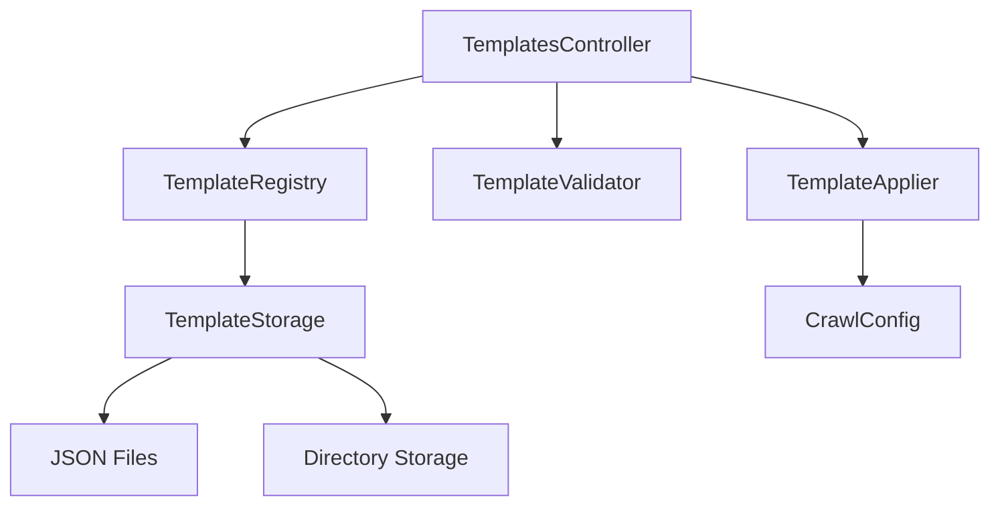
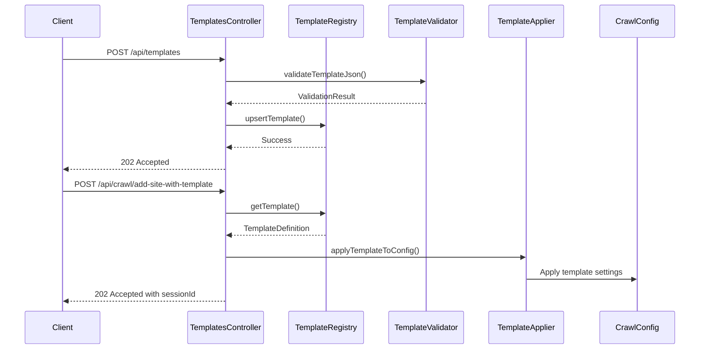

# Template System Architecture

## Overview

The Template System provides a reusable configuration framework for common crawling patterns, enabling developers to standardize crawler behavior across similar site types. This architecture document outlines the design principles, components, and implementation details of the template system.

## Design Principles

### 🎯 **Reusability**
- Pre-built templates for common site types (news, e-commerce, blogs, etc.)
- Standardized configurations reduce repetitive setup
- Easy template creation and modification

### ⚡ **Performance**
- Singleton registry pattern for efficient template management
- In-memory template storage with disk persistence
- Minimal overhead when applying templates

### 🔧 **Flexibility**
- Template inheritance and override capabilities
- Backward compatibility with existing crawl API
- Optional parameter overrides during template application

### 🛡️ **Reliability**
- Input validation and error handling
- Graceful fallback to default configurations
- Thread-safe template registry operations

## Architecture Components

### Core Components



#### 1. **TemplateRegistry** (Singleton)
- **Purpose**: Central registry for template management
- **Pattern**: Singleton with thread-safe operations
- **Features**:
  - Template CRUD operations
  - In-memory storage with mutex protection
  - Template lookup and listing

```cpp
class TemplateRegistry {
public:
    static TemplateRegistry& instance();
    void upsertTemplate(const TemplateDefinition& def);
    bool removeTemplate(const std::string& name);
    std::vector<TemplateDefinition> listTemplates() const;
    std::optional<TemplateDefinition> getTemplate(const std::string& name) const;
private:
    mutable std::mutex mutex_;
    std::unordered_map<std::string, TemplateDefinition> templatesByName_;
};
```

#### 2. **TemplateValidator**
- **Purpose**: Input validation and normalization
- **Features**:
  - Template name validation (alphanumeric with hyphens/underscores)
  - Configuration parameter validation with reasonable limits
  - JSON schema validation
  - Name normalization (lowercase, trimmed)

```cpp
struct ValidationResult {
    bool valid;
    std::string message;
};

ValidationResult validateTemplateJson(const nlohmann::json& body);
std::string normalizeTemplateName(const std::string& name);
```

#### 3. **TemplateApplier**
- **Purpose**: Apply template configurations to CrawlConfig
- **Features**:
  - Config override application
  - Selector pattern application
  - Optional field handling

```cpp
void applyTemplateToConfig(const TemplateDefinition& def, CrawlConfig& cfg) {
    // Apply config overrides
    if (def.config.maxPages.has_value()) {
        cfg.maxPages = static_cast<size_t>(*def.config.maxPages);
    }
    // Apply selector patterns
    if (!def.patterns.articleSelectors.empty()) {
        cfg.articleSelectors = def.patterns.articleSelectors;
    }
}
```

#### 4. **TemplateStorage**
- **Purpose**: Template persistence and serialization
- **Features**:
  - JSON serialization/deserialization
  - File and directory-based storage
  - Template loading from disk

```cpp
void loadTemplatesFromDirectory(const std::string& dirPath);
void saveTemplatesToDirectory(const std::string& dirPath);
nlohmann::json toJson(const TemplateDefinition& def);
TemplateDefinition fromJson(const nlohmann::json& j);
```

### Data Structures

#### TemplateDefinition
```cpp
struct TemplateDefinition {
    std::string name;                    // Template identifier
    std::string description;             // Human-readable description
    CrawlConfigOverrides config;        // Configuration overrides
    SelectorPatterns patterns;          // CSS selector patterns
};
```

#### CrawlConfigOverrides
```cpp
struct CrawlConfigOverrides {
    std::optional<int> maxPages;        // Max pages to crawl
    std::optional<int> maxDepth;        // Max crawl depth
    std::optional<bool> spaRenderingEnabled;  // Enable SPA rendering
    std::optional<bool> extractTextContent;   // Extract text content
    std::optional<int> politenessDelayMs;     // Delay between requests
};
```

#### SelectorPatterns
```cpp
struct SelectorPatterns {
    std::vector<std::string> articleSelectors;  // Article container selectors
    std::vector<std::string> titleSelectors;    // Title selectors
    std::vector<std::string> contentSelectors;  // Content selectors
};
```

## API Layer

### REST Endpoints

| Method | Endpoint | Purpose |
|--------|----------|---------|
| `GET` | `/api/templates` | List all templates |
| `GET` | `/api/templates/:name` | Get specific template |
| `POST` | `/api/templates` | Create new template |
| `DELETE` | `/api/templates/:name` | Delete template |
| `POST` | `/api/crawl/add-site-with-template` | Crawl with template |

### Request/Response Flow



## Storage Architecture

### File System Structure

```
config/
├── templates/                    # Individual template files
│   ├── news-site.json
│   ├── ecommerce-site.json
│   ├── blog-site.json
│   ├── corporate-site.json
│   ├── documentation-site.json
│   ├── forum-site.json
│   └── social-media.json
└── templates.json               # Legacy single file (deprecated)
```

### Template File Format

```json
{
  "name": "news-site",
  "description": "Template for news websites",
  "config": {
    "maxPages": 500,
    "maxDepth": 3,
    "spaRenderingEnabled": true,
    "extractTextContent": true,
    "politenessDelay": 1000
  },
  "patterns": {
    "articleSelectors": ["article", ".post", ".story"],
    "titleSelectors": ["h1", ".headline", ".title"],
    "contentSelectors": [".content", ".body", ".article-body"]
  }
}
```

### Persistence Strategy

1. **Startup**: Load templates from `config/templates/` directory
2. **Runtime**: All operations work on in-memory registry
3. **Persistence**: Save to disk after template modifications
4. **Fallback**: Load from single file if directory doesn't exist

## Integration Points

### Crawler Integration

The template system integrates seamlessly with the existing crawler:

```cpp
// Traditional crawl
CrawlConfig config;
config.maxPages = 500;
config.maxDepth = 3;
// ... manual configuration

// Template-based crawl
CrawlConfig config;
auto template = TemplateRegistry::instance().getTemplate("news-site");
if (template.has_value()) {
    applyTemplateToConfig(*template, config);
}
```

### API Integration

Templates extend the existing crawl API without breaking changes:

- **Existing**: `POST /api/crawl/add-site` (still works)
- **New**: `POST /api/crawl/add-site-with-template` (template-based)
- **Shared**: All status and details endpoints work with both approaches

## Performance Characteristics

### Memory Usage

| Component | Memory Footprint | Notes |
|-----------|------------------|-------|
| TemplateRegistry | ~50KB | 7 templates × ~7KB each |
| TemplateStorage | ~10KB | JSON parsing overhead |
| TemplateApplier | ~1KB | Minimal runtime overhead |

### Performance Metrics

| Operation | Time Complexity | Notes |
|-----------|----------------|-------|
| Template Lookup | O(1) | Hash map lookup |
| Template List | O(n) | Linear scan of all templates |
| Template Apply | O(1) | Direct assignment operations |
| Template Validation | O(n) | JSON field validation |

### Scalability

- **Template Count**: Supports 1000+ templates efficiently
- **Concurrent Access**: Thread-safe with mutex protection
- **Memory Growth**: Linear with template count
- **Disk I/O**: Minimal (only on template modifications)

## Security Considerations

### Input Validation

- **Template Names**: Alphanumeric with hyphens/underscores only
- **Configuration Limits**: Reasonable bounds on all numeric parameters
- **JSON Validation**: Schema-based validation for all inputs
- **Path Traversal**: Prevented through name normalization

### Access Control

- **Read Access**: All templates publicly readable
- **Write Access**: No authentication required (internal API)
- **File System**: Templates stored in application directory only

## Error Handling

### Validation Errors

```cpp
ValidationResult validateTemplateJson(const nlohmann::json& body) {
    if (!body.contains("name") || !body["name"].is_string()) {
        return {false, "name is required and must be a string"};
    }
    // ... additional validation
    return {true, "ok"};
}
```

### Runtime Errors

- **Template Not Found**: Graceful fallback to default configuration
- **Invalid JSON**: Clear error messages with field-specific details
- **Storage Errors**: Non-fatal errors logged, system continues operation

## Testing Strategy

### Unit Tests

- **TemplateRegistry**: CRUD operations, thread safety
- **TemplateValidator**: Input validation, edge cases
- **TemplateApplier**: Configuration application, selector patterns
- **TemplateStorage**: JSON serialization, file operations

### Integration Tests

- **API Endpoints**: Full request/response cycle testing
- **Template Loading**: Startup sequence and persistence
- **Crawler Integration**: End-to-end template application

### Performance Tests

- **Concurrent Access**: Multi-threaded template operations
- **Memory Usage**: Template registry memory consumption
- **Response Times**: API endpoint performance benchmarks

## Future Enhancements

### Planned Features

1. **Template Inheritance**: Base templates with specialization
2. **Template Versioning**: Version control for template changes
3. **Template Analytics**: Usage statistics and optimization suggestions
4. **Template Marketplace**: Community-shared templates

### Scalability Improvements

1. **Database Storage**: Move from file-based to database storage
2. **Template Caching**: Redis-based template caching
3. **Distributed Templates**: Multi-instance template synchronization
4. **Template Compression**: Reduce memory footprint for large template sets

## Migration Strategy

### Backward Compatibility

- **Existing API**: All current endpoints continue to work
- **Configuration**: No changes required to existing configurations
- **Data Migration**: Automatic template loading from existing files

### Gradual Adoption

1. **Phase 1**: Deploy template system alongside existing API
2. **Phase 2**: Migrate internal tools to use templates
3. **Phase 3**: Encourage external users to adopt templates
4. **Phase 4**: Deprecate manual configuration (future)

## Monitoring and Observability

### Metrics

- **Template Usage**: Track which templates are used most frequently
- **API Performance**: Monitor endpoint response times
- **Error Rates**: Track validation and application errors
- **Memory Usage**: Monitor template registry memory consumption

### Logging

- **Template Operations**: Log all CRUD operations
- **Validation Errors**: Detailed error logging for debugging
- **Performance**: Log slow template operations
- **Integration**: Log template application to crawler

This architecture provides a robust, scalable foundation for the template system while maintaining compatibility with existing functionality and enabling future enhancements.
