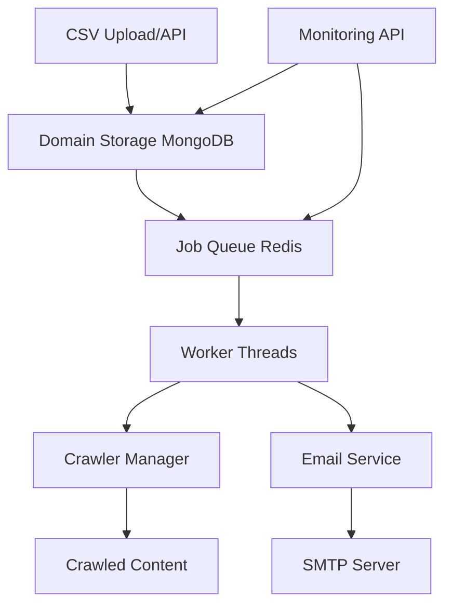

# 🚀 **Feature Request: Bulk Domain Crawling & Email Notification System**

## **📋 Summary**

Implement a scalable bulk domain crawling system that can efficiently crawl thousands of domains (5 pages each) and automatically send email notifications to webmasters upon completion.

## **🎯 Problem Statement**

Currently, the search engine can only crawl domains individually through manual requests. For indexing large numbers of websites (2000+ domains), we need:

- **Scalable queue system** for managing bulk crawl operations
- **Automated email notifications** to inform webmasters about crawling activity
- **Progress monitoring** and statistics tracking
- **Failure handling** and retry mechanisms
- **Future extensibility** for growing domain lists

## **💼 Use Cases**

### **Primary Use Case**
- **SEO Company**: Wants to crawl 2000 client websites (5 pages each) and automatically notify webmasters
- **Directory Service**: Needs to regularly crawl thousands of submitted websites
- **Research Institution**: Requires bulk crawling of educational domains for analysis

### **User Stories**
- As a **system administrator**, I want to upload a CSV file with 2000 domains and have them all crawled automatically
- As a **webmaster**, I want to receive a professional email notification when my site has been crawled
- As an **operator**, I want to monitor crawl progress in real-time and see completion statistics
- As a **developer**, I want to easily extend the system to handle 10,000+ domains in the future

## **🔧 Technical Requirements**

### **Core Features**
- [ ] **Bulk Domain Management**
  - CSV import/export functionality
  - Domain validation and deduplication
  - Webmaster email storage and validation
  - Configurable pages-per-domain limits

- [ ] **Queue-Based Crawling System**
  - Redis-based job queue for scalability
  - Configurable concurrent crawl limits (10-20 simultaneous)
  - Politeness delays and rate limiting per domain
  - Circuit breaker pattern for failing domains

- [ ] **Email Notification System**
  - Professional email templates for webmaster notifications
  - SMTP configuration support
  - Template customization (subject, content, branding)
  - Delivery tracking and retry logic

- [ ] **Monitoring & Statistics**
  - Real-time progress tracking
  - Success/failure rate monitoring
  - Estimated completion times
  - Health checks and alerting

### **Performance Requirements**
- **Throughput**: Process 2000 domains in 4-6 hours
- **Concurrency**: 10-20 simultaneous crawl sessions
- **Reliability**: 95%+ success rate with automatic retries
- **Scalability**: Easily extensible to 10,000+ domains

### **API Requirements**
```http
POST /api/v2/domains/import          # CSV import
POST /api/v2/domains/bulk           # Add multiple domains
POST /api/v2/domains/crawl/bulk     # Start bulk crawling
GET  /api/v2/domains/stats          # Domain statistics
GET  /api/v2/domains/queue/stats    # Job queue status
GET  /api/v2/domains/health         # System health check
```

## **🏗️ Proposed Architecture**



### **Component Breakdown**

1. **DomainStorage (MongoDB)**
   - Domain registry with status tracking
   - Webmaster email storage
   - Crawl results and statistics
   - Batch management

2. **JobQueue (Redis)**
   - Distributed job processing
   - Priority queuing
   - Retry logic with exponential backoff
   - Progress tracking

3. **EmailService**
   - Template-based notifications
   - SMTP integration
   - Delivery tracking
   - Professional templates

4. **API Layer**
   - RESTful endpoints
   - Bulk operations
   - Real-time statistics
   - Health monitoring

## **📊 Expected Benefits**

### **Operational Benefits**
- **95% time savings** compared to manual crawling
- **Automated compliance** with webmaster notification best practices  
- **Professional communication** with website owners
- **Scalable infrastructure** ready for growth

### **Technical Benefits**
- **Fault tolerant** job processing with Redis
- **Persistent storage** with MongoDB
- **Real-time monitoring** and alerting
- **Clean separation** of concerns

## **🛠️ Implementation Plan**

### **Phase 1: Core Infrastructure** ⏱️ 2 weeks
- [ ] MongoDB domain storage schema
- [ ] Redis job queue system
- [ ] Basic API endpoints
- [ ] Unit tests

### **Phase 2: Crawling Integration** ⏱️ 1 week
- [ ] Integration with existing crawler
- [ ] Batch job processing
- [ ] Error handling and retries
- [ ] Performance optimization

### **Phase 3: Email & Monitoring** ⏱️ 1 week
- [ ] Email service implementation
- [ ] Professional email templates
- [ ] Monitoring dashboard
- [ ] Statistics API

### **Phase 4: User Interface** ⏱️ 1 week
- [ ] CSV import functionality
- [ ] Progress monitoring UI
- [ ] Administrative controls
- [ ] Documentation

## **📋 Acceptance Criteria**

### **Functional Requirements**
- [ ] Successfully import 2000 domains from CSV
- [ ] Crawl all domains with configurable page limits (default: 5 pages)
- [ ] Send professional email notifications to webmasters
- [ ] Complete bulk operation within 6 hours
- [ ] Achieve 95%+ success rate with retries
- [ ] Provide real-time progress monitoring
- [ ] Handle system restarts gracefully

### **Non-Functional Requirements**
- [ ] Support concurrent crawling (10-20 domains simultaneously)
- [ ] Respect robots.txt and implement politeness delays
- [ ] Maintain detailed logs for debugging
- [ ] Provide comprehensive error reporting
- [ ] Scale to 10,000+ domains without architecture changes

## **🧪 Testing Strategy**

### **Unit Tests**
- Domain validation logic
- Job queue operations
- Email template rendering
- API endpoint responses

### **Integration Tests**
- End-to-end crawl workflow
- Email delivery verification
- Database persistence
- Queue processing

### **Load Tests**
- 2000 domain bulk operation
- Concurrent crawl limits
- System resource utilization
- Recovery from failures

## **📄 Sample Usage**

### **CSV Format**
```csv
domain,webmaster_email,max_pages
example1.com,admin@example1.com,5
example2.com,webmaster@example2.com,5
sample.org,contact@sample.org,5
```

### **API Usage**
```bash
# Import domains
curl -X POST "http://localhost:3000/api/v2/domains/import" \
  -H "Content-Type: text/csv" \
  --data-binary @domains.csv

# Start bulk crawl
curl -X POST "http://localhost:3000/api/v2/domains/crawl/bulk" \
  -H "Content-Type: application/json" \
  -d '{"maxConcurrent": 15, "emailNotifications": true}'

# Monitor progress
curl "http://localhost:3000/api/v2/domains/stats"
```

### **Python Script**
```python
python3 bulk_crawl_example.py domains.csv --max-concurrent 15
```

## **🔒 Security Considerations**

- **Input validation** for domains and email addresses
- **Rate limiting** on API endpoints
- **Email delivery limits** to prevent spam
- **Secure storage** of webmaster contact information
- **Access controls** for administrative functions

## **🌟 Future Enhancements**

- [ ] **Scheduled crawling** (weekly, monthly recurring)
- [ ] **Webhook notifications** for integrations  
- [ ] **Custom crawl configurations** per domain
- [ ] **Advanced reporting** and analytics
- [ ] **Multi-language email** templates
- [ ] **Whitelabel email** customization

## **💡 Alternative Approaches Considered**

1. **File-based processing** - Rejected due to scalability limitations
2. **Kafka message queue** - Redis chosen for simplicity and existing infrastructure
3. **Synchronous crawling** - Async approach chosen for better resource utilization
4. **Manual email sending** - Automated approach chosen for consistency

## **📚 Related Issues**

- #XXX - Improve crawler performance
- #XXX - Add email notification system  
- #XXX - MongoDB integration optimization

---

**Priority**: High  
**Effort**: Large (5 weeks)  
**Labels**: `enhancement`, `feature`, `crawler`, `email`, `bulk-operations`  
**Milestone**: Q1 2025
